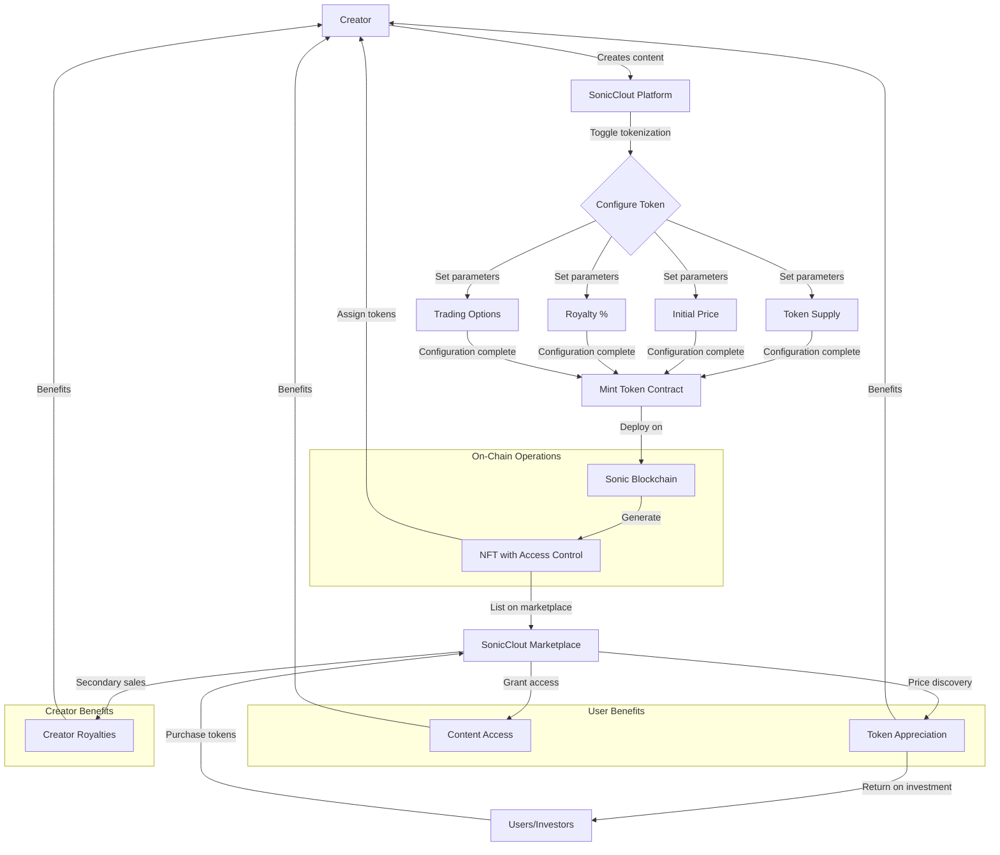
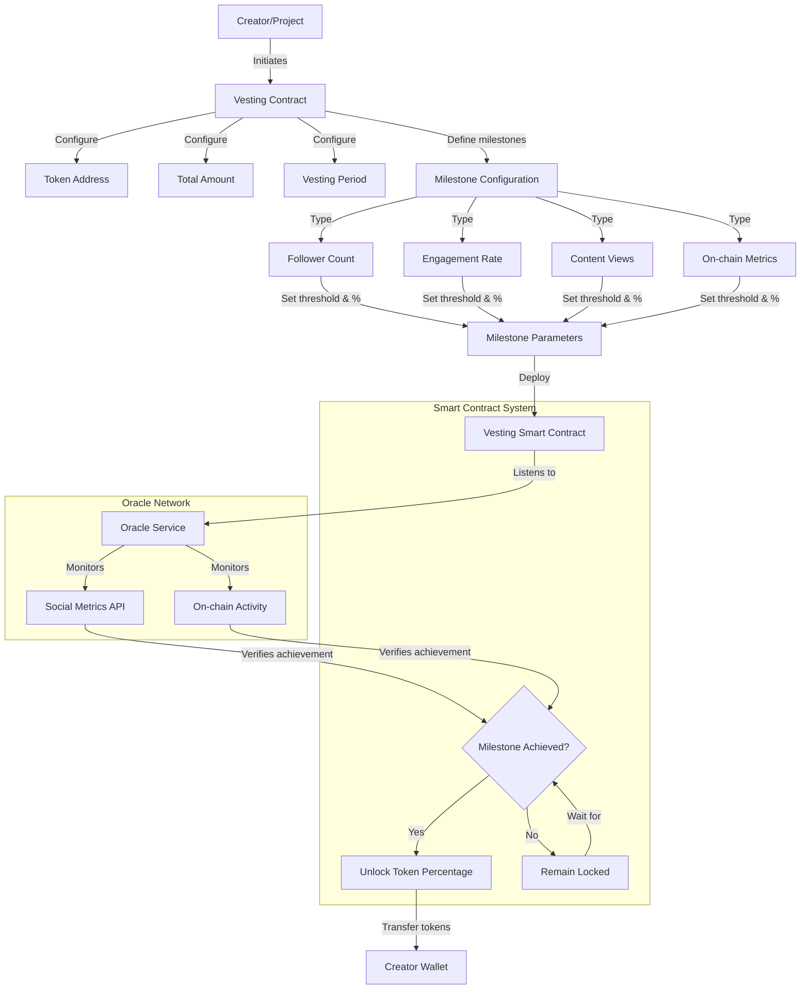
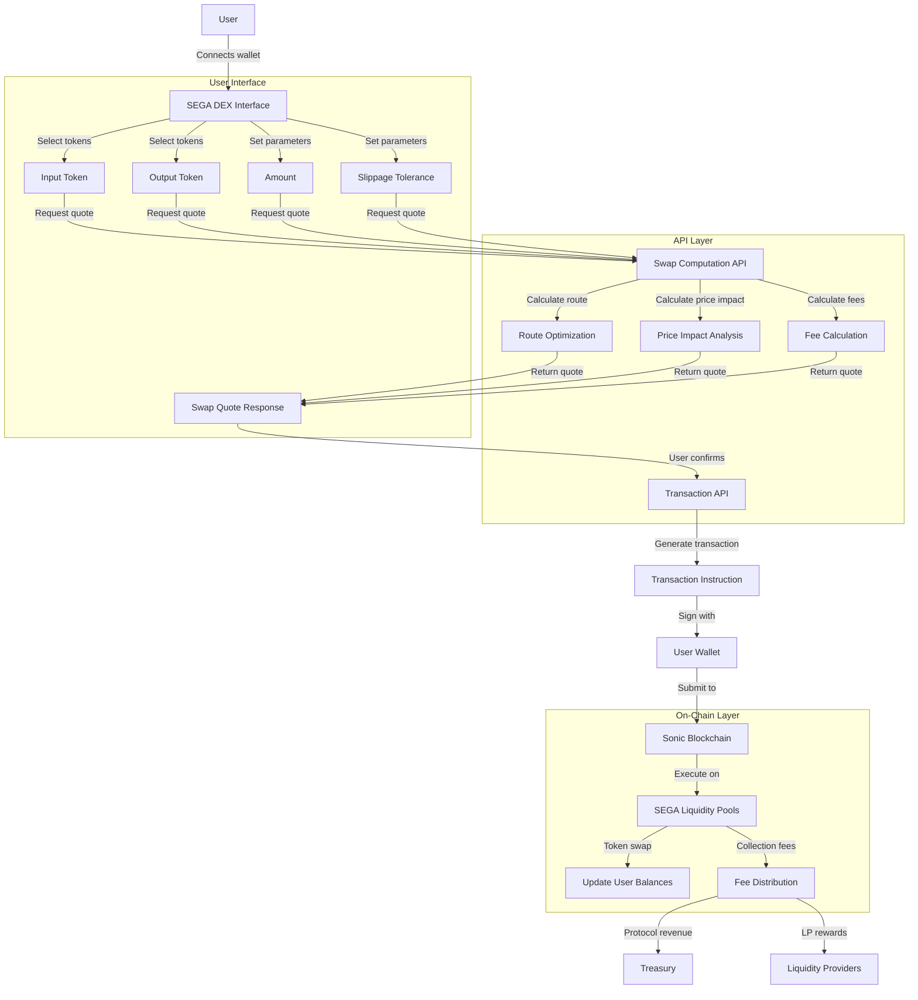
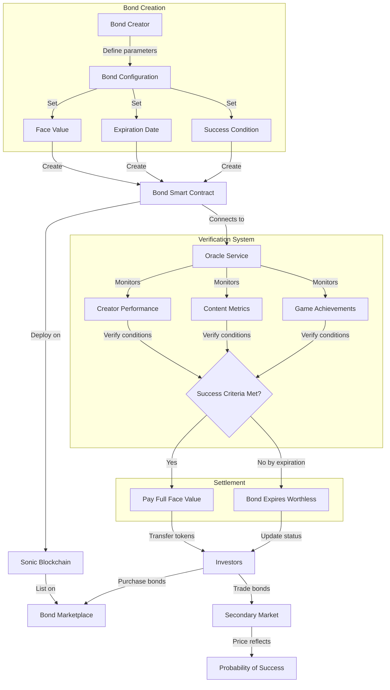

# SonicClout Technical Architecture

This document provides an overview of the technical architecture behind SonicClout's key features using flow diagrams to illustrate the various processes and their interactions.

## Table of Contents

1. [Content Tokenization](#1-content-tokenization)
2. [Skill-Based Vesting](#2-skill-based-vesting)
3. [SEGA Trading Protocol](#3-sega-trading-protocol)
4. [Sonic Bonds](#4-sonic-bonds)

## 1. Content Tokenization

The content tokenization process transforms creator content into tradable digital assets on the Sonic blockchain.

### How Content Tokenization Works

1. **Content Creation**: A creator produces content on the SonicClout platform, which could be text, images, videos, or any combination.

2. **Tokenization Configuration**:
   - The creator toggles tokenization and sets parameters including token supply, initial price, royalty percentage, and trading options.
   - These parameters determine the token economics of the content.

3. **Token Contract Deployment**:
   - SonicClout generates and deploys a token contract on the Sonic blockchain.
   - This contract creates a unique token linked to the specific content with embedded metadata and access control mechanisms.

4. **Token Distribution**:
   - Initial tokens are allocated to the creator.
   - Remaining tokens are made available for purchase in the marketplace.

5. **Marketplace Integration**:
   - The tokenized content appears in the SonicClout marketplace where users can purchase access tokens.
   - Token ownership grants access to the content and represents a tradable asset.

6. **Secondary Trading**:
   - Tokens can be traded on secondary markets.
   - Creators earn royalties from each secondary sale.
   - Token prices fluctuate based on creator popularity and content value.

### Benefits

- **For Creators**:
  - Direct monetization of content without intermediaries
  - Ongoing revenue through royalties from secondary sales
  - Stronger community incentives for promotion and engagement

- **For Users/Fans**:
  - Access to premium content
  - Potential financial upside if tokens appreciate in value
  - Tangible way to support favorite creators

- **For Investors**:
  - New asset class focused on creator success
  - Opportunity to identify and invest in rising talent
  - Portfolio diversification across creator economy

## 2. Skill-Based Vesting

Skill-based vesting replaces traditional time-based vesting with performance metrics, creating alignment between creators and investors.

### How Skill-Based Vesting Works

1. **Vesting Contract Initialization**:
   - A creator initiates a vesting contract on the SonicClout platform.
   - They specify the token address, total amount to be vested, and overall vesting period.

2. **Milestone Definition**:
   - Instead of simple time-based unlocking, creators define performance-based milestones.
   - Milestone types include social metrics (follower count, engagement rate, content views) and on-chain metrics.
   - Each milestone has a threshold and a corresponding percentage of tokens to unlock.

3. **Smart Contract Deployment**:
   - The configured vesting terms are deployed as a smart contract on the Sonic blockchain.

4. **Oracle Integration**:
   - The vesting contract connects to an oracle service that monitors both off-chain (social) and on-chain metrics.
   - The oracle provides verified data to the smart contract through secure feeds.

5. **Milestone Verification**:
   - When a milestone is achieved, the oracle reports this to the smart contract.
   - The contract automatically verifies the achievement against the predetermined conditions.

6. **Token Unlocking**:
   - Upon verification, the corresponding percentage of tokens is unlocked and transferred to the creator's wallet.
   - Tokens remain locked until their respective milestones are achieved.

### Benefits

- **For Creators**:
  - Incentivizes growth and performance
  - Aligns compensation with actual achievement
  - Provides predictable rewards for reaching milestones

- **For Investors**:
  - Reduces risk by tying token release to real value creation
  - Ensures creator commitment to growth metrics
  - Creates transparent, verifiable performance benchmarks

- **For the Ecosystem**:
  - Promotes sustainable growth over vanity metrics
  - Establishes objective criteria for success
  - Creates a merit-based creator economy

## 3. SEGA Trading Protocol

The SEGA Trading Protocol is SonicClout's proprietary decentralized exchange (DEX) specifically optimized for creator tokens.

### How the SEGA Trading Protocol Works

1. **User Interface Interaction**:
   - Users connect their wallet to the SEGA DEX interface.
   - They select input and output tokens, specify the amount, and set slippage tolerance.

2. **Swap Computation**:
   - The interface calls the Swap Computation API with the user's parameters.
   - The API calculates the optimal routing through available liquidity pools, analyzes price impact, and calculates fees.
   - The result is returned as a swap quote response with detailed information.

3. **Transaction Generation**:
   - When the user confirms the transaction, the system calls the Transaction API.
   - This API generates the necessary transaction instructions based on the swap quote.

4. **Transaction Execution**:
   - The user signs the transaction with their connected wallet.
   - The signed transaction is submitted to the Sonic blockchain.
   - The transaction executes across the specified SEGA liquidity pools.

5. **Settlement and Fee Distribution**:
   - The token swap updates user balances.
   - Trading fees are collected and distributed between:
     - Protocol treasury (protocol fee)
     - Liquidity providers (LP rewards)

### Technical Components

- **API Layer**: Handles complex computations off-chain to optimize gas costs
- **On-Chain Layer**: Executes the actual token swaps via smart contracts
- **User Interface**: Provides an intuitive experience for trading

### Benefits

- **For Traders**:
  - Low latency and high throughput trading
  - Minimal slippage for creator tokens
  - Optimized routing for best execution price

- **For Creators**:
  - Liquid market for their tokenized content
  - Price discovery mechanism for content value
  - Reduced volatility through specialized market making

- **For Liquidity Providers**:
  - Earn fees by providing liquidity to content token pairs
  - Participate in the growth of the creator economy
  - Access to unique yield opportunities

## 4. Sonic Bonds

Sonic Bonds are innovative financial derivatives that tokenize future creator achievements and milestones.

### How Sonic Bonds Work

1. **Bond Creation**:
   - A bond creator (typically a platform or creator) defines the parameters of a new bond.
   - Key parameters include face value (payout amount), expiration date, and specific success conditions.
   - Success conditions can be tied to creator performance, content metrics, or gaming achievements.

2. **Smart Contract Deployment**:
   - A bond smart contract with these parameters is created and deployed on the Sonic blockchain.
   - The contract codifies the terms of the bond, including payment conditions.

3. **Marketplace Listing**:
   - The bond is listed on the Bond Marketplace where investors can purchase it.
   - Initial pricing is typically at a discount to face value, reflecting the risk of the conditions not being met.

4. **Verification System**:
   - The bond contract connects to an oracle service that monitors relevant metrics.
   - The oracle tracks creator performance, content metrics, or game achievements as specified in the bond terms.

5. **Success Determination**:
   - The system continuously evaluates whether the success criteria have been met.
   - If conditions are met before expiration, the bond pays out its full face value.
   - If conditions are not met by expiration, the bond expires worthless.

6. **Secondary Trading**:
   - Before settlement, investors can trade bonds on the secondary market.
   - Bond prices fluctuate based on the perceived probability of success.
   - Trading allows for price discovery and risk transfer.

### Examples of Sonic Bonds

- **Achievement Bonds**: Pay out when a creator accomplishes a specific gaming achievement
- **Milestone Bonds**: Tied to follower or subscriber count milestones
- **Collaboration Bonds**: Pay out when specific creators collaborate within a timeframe
- **Viral Content Bonds**: Linked to content reaching virality thresholds

### Benefits

- **For Creators**:
  - Upfront funding based on future potential
  - New monetization method beyond direct content sales
  - Incentive alignment with their community

- **For Investors**:
  - Binary outcome investments with clear terms
  - Portfolio diversification with creator-economy exposure
  - Potential for high returns based on creator insights

- **For the Platform**:
  - Increases engagement and creates fan investment
  - Provides liquidity and valuation mechanisms
  - Creates innovative financial products unique to the creator economy

## Technical Implementation Notes

Each of these systems is implemented using a combination of:

1. **Smart Contracts**: Written in Rust for the Sonic blockchain to handle on-chain logic
2. **Oracle Networks**: To connect on-chain contracts with off-chain data
3. **API Layer**: For computation-intensive operations and integration with external systems
4. **Frontend Interfaces**: For intuitive user interactions and visualizations

The architecture prioritizes:
- **Scalability**: Handling high transaction volumes
- **Security**: Protecting user assets and data
- **Usability**: Making complex DeFi mechanisms accessible
- **Interoperability**: Enabling connections with the broader blockchain ecosystem 